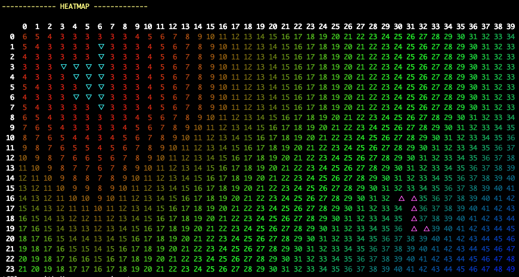
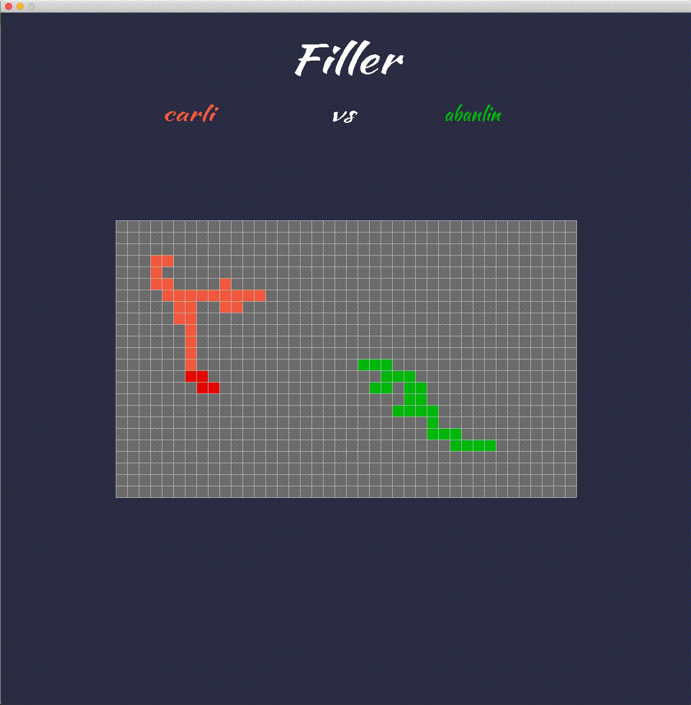

# Filler

Filler is a project where a virtual machine takes two champions. The virtual machine will give each champion a random piece. The champion have to user the piece to fill the map. The champion with the greatest territory filled wins the game. Thus in order to win, we have to maximise our chances and lower the ones of the other champion.

## Heatmap

The developped algorithm consisted in a heatmap. For each piece given we try to place it near the opposite champion. The lower the score on heatmap for a piece the better it is placed.

## Filler visualizer (SDL2)

A visualizer was done using the SDL to better watch how a match between two champions goes.

### Final mark (125/125)